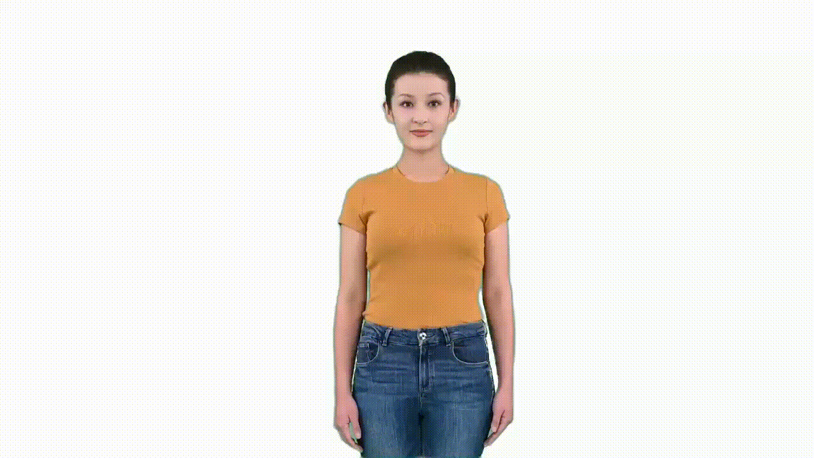
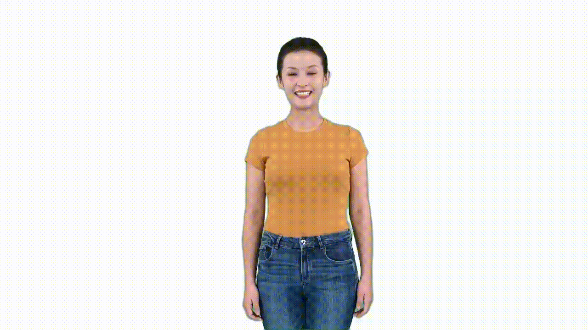
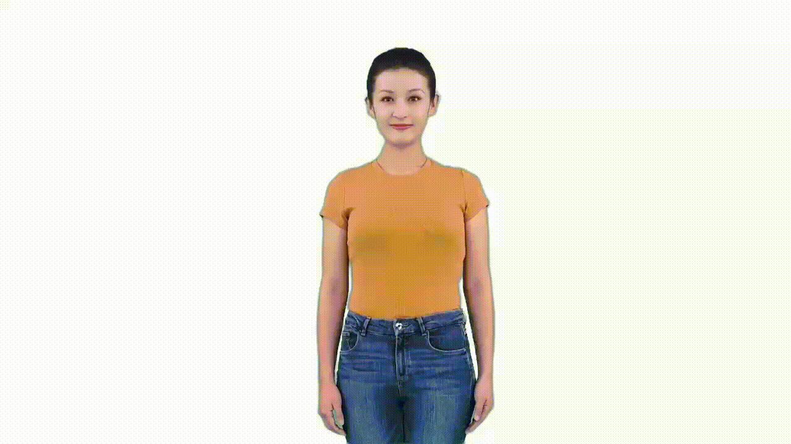

# How to record video samples for custom text to speech avatar (preview)

[!INCLUDE [Text to speech avatar preview](../includes/text-to-speech-avatar-preview.md)]

This article provides instructions on preparing high-quality video samples for creating a custom text to speech avatar.

Custom text to speech avatar model building requires training on a video recording of a real human speaking. This person is the avatar talent. You must get sufficient consent under all relevant laws and regulations from the avatar talent to create a custom avatar from their talent's image or likeness. Refer to [Get consent file from the avatar talent](custom-avatar-create.md#get-consent-file-from-the-avatar-talent) to learn requirement of consent statement video.

## Recording environment

We recommend recording in a professional video shooting studio or a well-lit place. 

### Background requirement

- If you need a commercial, multi-scene avatar, the background of the video should be clean, smooth, pure-colored, and a green screen is the best choice.
- If your avatar only needs to be used in a single scene, you can select a specific scene to record (such as in your office), but the background can't be subtracted and changed.
- Tips about using a pure-colored background (such as green screen) in shooting:
  
  | Dos                                     | Don'ts                                                |
  |-----------------------------------------|--------------------------------------------------------|
  | - A green screen is set behind your back, and if your avatar video shows the full body of the actor, including feet, there should be a green screen under the feet. And the back green screen and floor green screen should be completely connected.  - The green screen should be flat, and the color is uniform.  - The actor should keep 0.5 m – 1 m distance away from the back background. - The green screen can be properly lit to prevent shadows. - The full outline of the actor is within the edge of the green screen.| - The actor shouldn't stand too close to the green screen. - Avoid the actor’s head and hands spilling out of the green screen when speaking.| 

### Lighting requirement

- Ensure even and bright lighting on the actor's face, avoiding shadows on the face or reflections on actor's glasses and clothes.
- Try to avoid the impact of changes in ambient light on actors. It's recommended to turn off the projector, close the curtains to avoid daylight changes, and use a stable artificial light source, etc.

### Devices

- Camera requirement: A minimum of 1080-P resolution and 25 FPS (frames per second).
- Don't change the position of light and camera after settling down during the whole video shooting.
- You can use a teleprompter to remind the script during recording but ensure it doesn't affect the actor's gaze towards the camera. Provide a seat if the avatar needs to be in a sitting position.
- For half-length or seated digital avatars, provide a seat for the actor. If you don't want the image of the chair to appear, you can choose a simple chair. 

## Appearance of the actor

The custom text to speech avatar doesn't support customization of clothes or looks. Therefore, it's essential to carefully design and prepare the avatar's appearance when recording the training data. Consider the following tips:

| Categories | Dos          | Don'ts         |
|------------|----------------------------|-------------------|
| **Hair**   | - The actor’s hair should have a smooth and glossy surface. - Even the actor’s bangs or broken hair should have a clear and smooth border. - Choose a hairstyle that is easy to keep consistent during the whole video recording. | - Avoid messy hair or backgrounds showing through the hair. - Do not let hair block the eyes or eyebrows. - Avoid shadows on the face caused by hairstyle. - Avoid hair changes too much during speech and body gesture. For example, the high ponytail of an actor may appear, disappear, and swing during speaking. |
| **Clothing** | - Pay attention to clothing status and make sure no significant changes on the clothing during speaking. | - Avoid wearing clothing and accessories that are too loose, heavy, or complex, as they may impact the consistency of clothing status during speaking and body gesture. - Avoid wearing clothing that is too similar to the background color or reflective materials like white shirts or translucent materials. - Avoid clothing with obvious lines or items with logos and brand names you don't want to highlight. - Avoid reflective elements such as metal belts, shiny leather shoes, and leather pants. |
| **Face**    | - Ensure the actor's face is clearly visible.  | - Avoid face obscured by hair, sunglasses, or accessories. |

## What video clips to record

You need three types of basic video clips:

**Status 0 speaking:**
   - Status 0 represents the posture you can naturally maintain most of the time while speaking. For example, arms crossed in front of the body or hanging down naturally at the sides. 
   - Maintain a front-facing pose. The actor can move slightly to show a relaxed status, like moving the head or shoulder slightly, but don't move the body too much.
   - Length: keep speaking in status 0 for 3-5 minutes.
     
**Samples of status 0 speaking:**

 

**Naturally speaking:**
   - Actor speaks in status 0 but with natural hand gestures from time to time.
   - Hands should start from status 0 and return after making gestures.
   - Use natural and common gestures when speaking. Avoid meaningful gestures like pointing, applause, or thumbs up.
   - Length: Minimum 5 minutes, maximum 30 minutes in total. At least one piece of 5-minute continuous video recording is required. If recording multiple video clips, keep each clip under 10 minutes.
     
**Samples of natural speaking:** 

**Silent status:**

This video clip is important if you build a real-time conversation with the custom avatar. The video clip is used as the main template for both speaking and listening status for a chatbot.

  - Maintain status 0, don't speak, but still feel relaxed.
  - Even remaining in status 0, don't keep completely still; you can move a little bit but not too much. Perform like you're waiting.
  - Maintain a smile as if listening or waiting patiently.
  - Length: 1 minute.
    
**Samples of silent status:** 

**Gestures (optional):**

Gesture video clips are optional, and customers who have the need to insert certain gestures in the avatar speaking can follow this guideline to take gesture videos. Gesture insertion is only enabled for batch mode avatar; real-time avatar doesn’t support gesture insertion at this point. Each custom avatar model can support no more than 10 gestures.

**Gesture tips:**
- Each gesture clip should be within 10 seconds.
- Gestures should start from status 0 and end with status 0; otherwise, the gesture clip can't be smoothly inserted into the avatar video.
- The gesture clip only captures the body gestures; the actor doesn’t have to speak during making gestures.
- We recommend designing a list of gestures before recording; here are some examples of gesture video clips:

**Samples of gesture:**

| Gestures                       | Samples                |
|--------------------------------|------------------------|
| Delivering sell link/promotion code |        |
| Praising the product         |         |
| Introducing the product          |        |
| Displaying the price (number from 1 to 10-fist-number with each hand) | Right hand  Left hand  |

High-quality avatar models are built from high-quality video recordings, including audio quality. Here are more tips for actor’s performance and recording video clips:

| **Dos** | **Don'ts**   |
|---------|--------------|
| - Ensure all video clips are taken in the same conditions. - During the recording process, design the size and display area of the character you need so that the character can be displayed on the screen appropriately.  - Actor should be steady during the recording.   - Mind facial expressions, which should be suitable for the avatar's use case. For example, look positive and smile if the custom text to speech avatar is used as customer service. Look professionally if the avatar is used for news reporting.  - Maintain eye gaze towards the camera, even when using a teleprompter.  - Return your body to status 0 when pausing speaking.  - Speak on a self-chosen topic, and minor speech mistakes like miss a word or mispronounced are acceptable. If the actor misses a word or mispronounces something, just go back to status 0, pause for 3 seconds, and then continue speaking.  - Consciously pause between sentences and paragraphs. When pausing, go back to the status 0 and close your lips.   - The audio should be clear and loud enough; bad audio quality impacts training result.  - Keep the shooting environment quiet. | - Don't adjust the camera parameters, focal length, position, angle of view. Don't move the camera; keep the person's position, size, angle, consistent in the camera.  - Characters that are too small may lead to a loss of image quality during post-processing. Characters that are too large may cause the screen to overflow during gestures and movements.  - Don't make too long gestures or too much movement for one gesture; for example, actor’s hands are always making gestures and forget to go back to status 0.  - The actor's movements and gestures must not block the face.  - Avoid small movements of the actor like licking lips, touching hair, talking sideways, constant head shaking during speech, and not closing up after speaking.  - Avoid background noise; staff should avoid walking and talking during video recording.  - Avoid other people’s voice recorded during the actor speaking. |

## Data requirements

Doing some basic processing of your video data is helpful for model training efficiency, such as: 

- Make sure that the character is in the middle of the screen, the size and position are consistent during the video processing. Each video processing parameter such as brightness, contrast remains the same and doesn't change. The output avatar's size, position, brightness, contrast will directly reflect those present in the training data. We don't apply any alterations during processing or model building.
- The start and end of the clip should be kept in state 0; the actors should close their mouths and smile, and look ahead. The video should be continuous, not abrupt.

**Avatar training video recording file format:** .mp4 or .mov.

**Resolution:** At least 1920x1080.

**Frame rate per second:** At least 25 FPS.

## Next steps

* [What is text to speech avatar](what-is-text-to-speech-avatar.md)
* [What is custom text to speech avatar](what-is-custom-text-to-speech-avatar.md)
