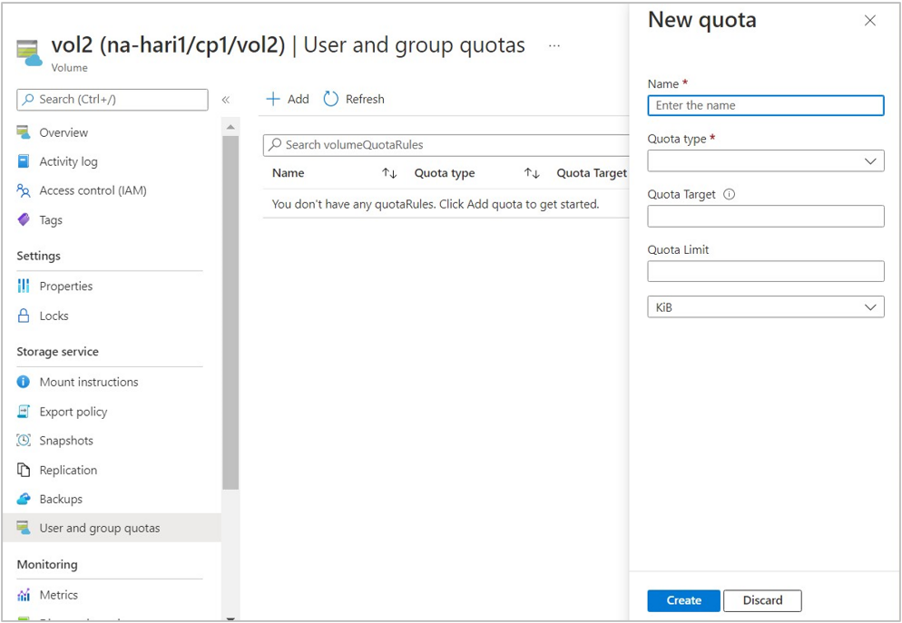
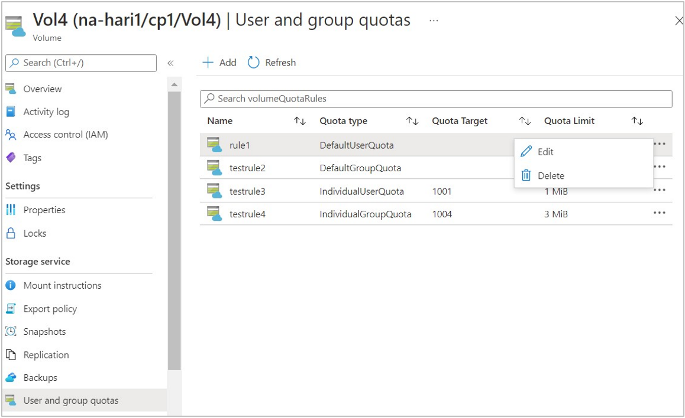
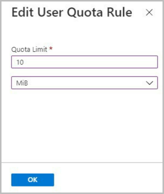

# Manage default and individual user and group quotas for a volume 

This article explains the considerations and steps for managing user and group quotas on Azure NetApp Files volumes. To understand the use cases for this feature, see [Understand default and individual user and group quotas](default-individual-user-group-quotas-introduction.md).

## Quotas in cross-region or cross-zone replication relationships

Quota rules are synced from cross-region replication (CRR) or cross-zone replication (CZR) source to destination volumes. Quota rules that you create, delete, or update on a CRR or CZR source volume automatically applies to the destination volume.

Quota rules only come into effect on the CRR/CZR destination volume after the replication relationship is deleted because the destination volume is read-only. To learn how to break the replication relationship, see [Delete volume replications](cross-region-replication-delete.md#delete-volume-replications). If source volumes have quota rules and you create a replication relationship later, all the quota rules are synced to the destination volume.

## Considerations 

* A quota rule is specific to a volume and is applied to an existing volume.  
* Deleting a volume results in deleting all the associated quota rules for that volume. 
* You can create a maximum number of 100 quota rules for a volume.
* Azure NetApp Files doesn't support individual group quota and default group quota for SMB and dual protocol volumes.
* Group quotas track the consumption of disk space for files owned by a particular group. A file can only be owned by exactly one group. 
* Auxiliary groups only help in permission checks. You can't use auxiliary groups to restrict the quota (disk space) for a file.
* In a CRR/CZR setting:
    * You can't create, update, or delete quota rules on the destination volume until you [delete the replication](cross-region-replication-delete.md).  
    * If a quota rule is in the error state after you delete the replication relationship, you need to delete and re-create the quota rule on the destination volume. 
* If you're using [large volumes](large-volumes-requirements-considerations.md) (volumes larger than 100 TiB):    
    * The space and file usage in a large volume might exceed as much as five percent more than the configured hard limit before the quota limit is enforced and rejects traffic.   
    * To provide optimal performance, the space consumption may exceed configured hard limit before the quota is enforced. The additional space consumption won't exceed either the lower of 1 GB or five percent of the configured hard limit.    
    * After reaching the quota limit, if a user or administrator deletes files or directories to reduce quota usage under the limit, subsequent quota-consuming file operations may resume with a delay of up to five seconds.

## Create new quota rules 

1. From the Azure portal, navigate to the volume for which you want to create a quota rule. Select **User and group quotas** in the navigation pane, then click **Add** to create a quota rule for a volume.  

     

2. In the **New quota** window that appears, provide information for the following fields, then click **Create**.

    * **Quota rule name**:   
        The name must be unique within the volume. 

    * **Quota type**:  
        Select one of the following options. For details, see [Understand default and individual user and group quotas](default-individual-user-group-quotas-introduction.md).   
        * `Default user quota`
        * `Default group quota` 
        * `Individual user quota` 
        * `Individual group quota`

    * **Quota target**:   
        * NFS volumes:  
            For individual user quota and individual group quota, specify a value in the range of `0` to `4294967295`.  
            For default quota, specify the value as `""`. 
        * SMB volumes:   
            For individual user quota, specify the range in the `^S-1-[0-59]-\d{2}-\d{8,10}-\d{8,10}-\d{8,10}-[1-9]\d{3}` format.  
        * Dual-protocol volumes:   
            For individual user quota using the SMB protocol, specify the range in the `^S-1-[0-59]-\d{2}-\d{8,10}-\d{8,10}-\d{8,10}-[1-9]\d{3}` format.  
            For individual user quota using the NFS protocol, specify a value in the range of `0` to `4294967295`.

    * **Quota limit**:    
        Specify the limit in the range of `1` to `1125899906842620`.  
        Select `KiB`, `MiB`, `GiB`, or `TiB` from the pulldown. The minimum configurable quota limit is 4 KiB.

## Edit or delete quota rules

1. On the Azure portal, navigate to the volume whose quota rule you want to edit or delete.  Select `…` at the end of the quota rule row, then select **Edit** or **Delete** as appropriate. 

     

    1. If you're editing a quota rule, update **Quota Limit** in the Edit User Quota Rule window that appears.
    
         

    1. If you're deleting a quota rule, confirm the deletion by selecting **Yes**.  
    
         

## Next steps 
* [Understand default and individual user and group quotas](default-individual-user-group-quotas-introduction.md)
* [Resource limits for Azure NetApp Files](azure-netapp-files-resource-limits.md)
