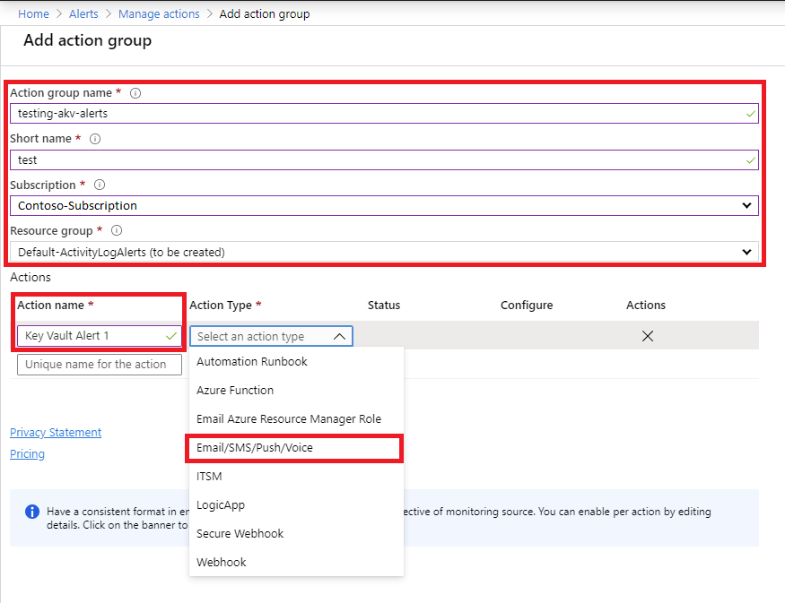
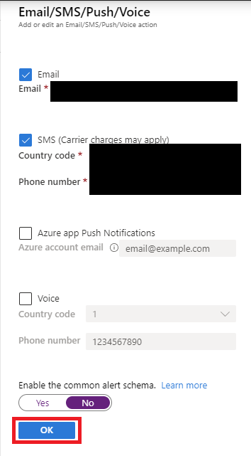
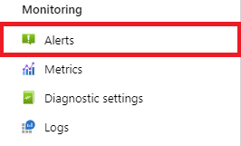
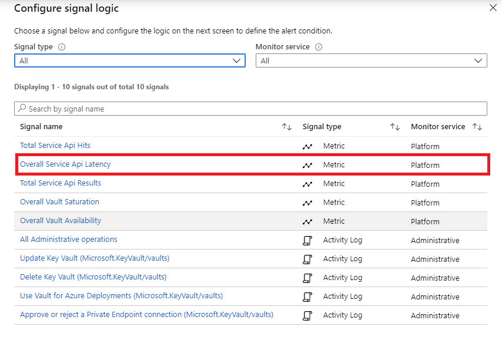
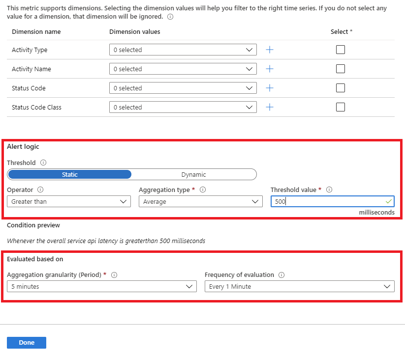
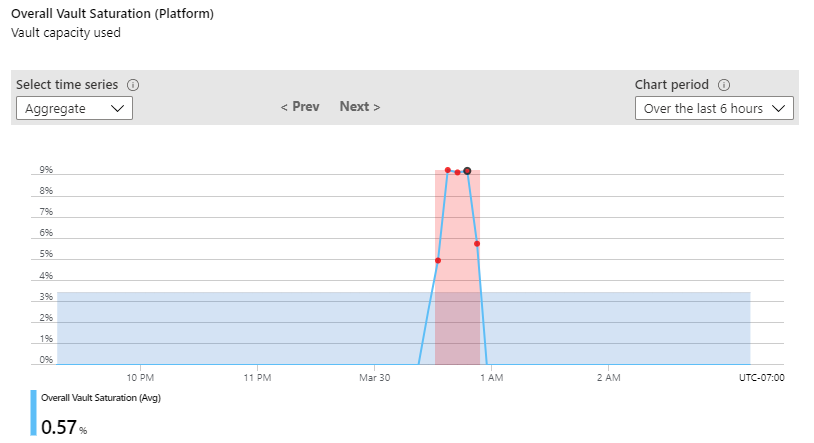
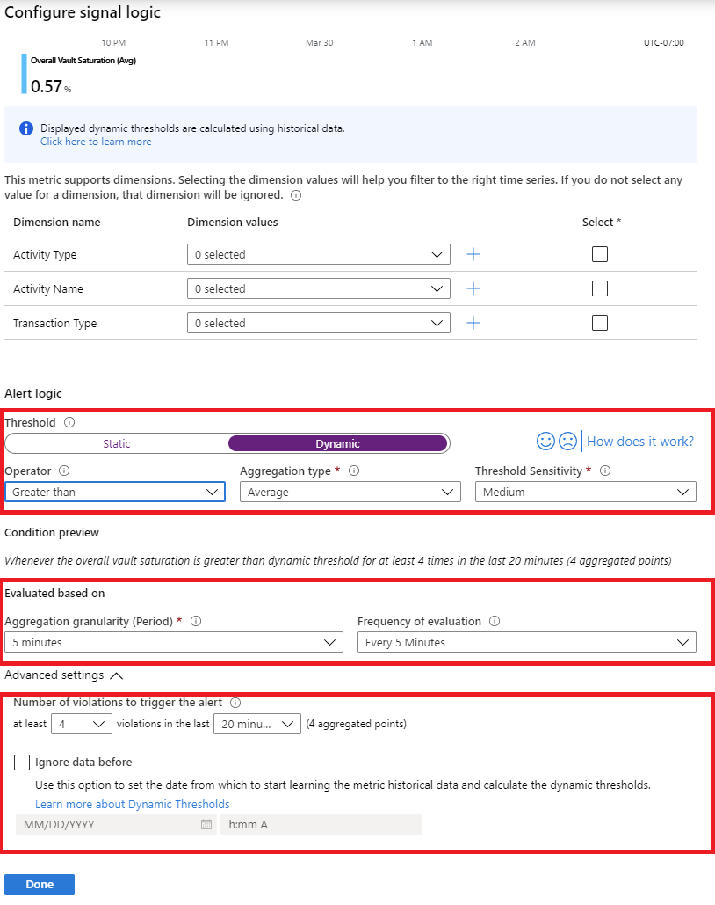
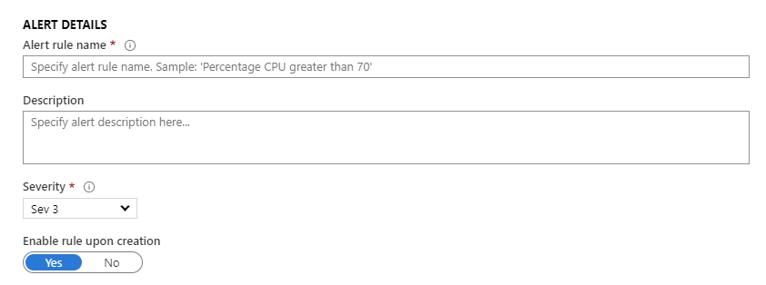
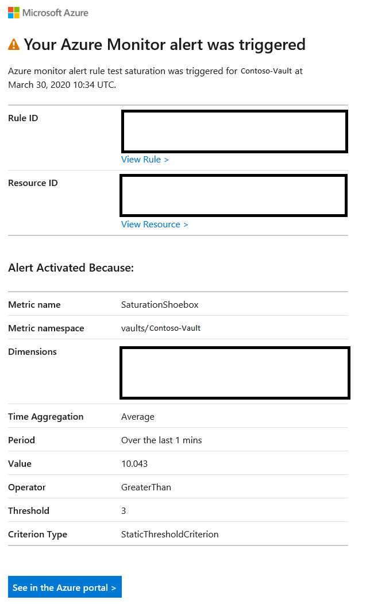

# Configure Azure Key Vault alerts

After you start to use Azure Key Vault to store your production secrets, it's important to monitor the health of your key vault to make sure that your service operates as intended. 

As you start to scale your service, the number of requests sent to your key vault will rise. This rise has a potential to increase the latency of your requests. In extreme cases, it can cause your requests to be throttled and affect the performance of your service. You also need to know if your key vault is sending an unusual number of error codes, so you can quickly handle any problems with an access policy or firewall configuration. 

This article will show you how to configure alerts at specified thresholds so you can alert your team to take action immediately if your key vault is in an unhealthy state. You can configure alerts that send an email (preferably to a team distribution list), fire an Azure Event Grid notification, or call or text a phone number. 

You can choose between these alert types:

- A static alert based on a fixed value
- A dynamic alert that will notify you if a monitored metric exceeds the average limit of your key vault a certain number of times within a defined time range

> [!IMPORTANT]
> It can take up to 10 minutes for newly configured alerts to start sending notifications. 

This article focuses on alerts for Key Vault. For information about Key Vault insights, which combines both logs and metrics to provide a global monitoring solution, see [Monitoring your key vault with Key Vault insights](../key-vault-insights-overview.md#introduction-to-key-vault-insights).

## Configure an action group 

An action group is a configurable list of notifications and properties. The first step in configuring alerts is to create an action group and choose an alert type:

1. Sign in to the Azure portal.
2. Search for **Alerts** in the search box.
3. Select **Manage actions**.

   > [!div class="mx-imgBorder"]
   > 

4. Select **+ Add action group**.

   > [!div class="mx-imgBorder"]
   > 

5. Choose the **Action Type** value for your action group. In this example, we'll create an email and SMS alert. Select **Email/SMS/Push/Voice**.

   > [!div class="mx-imgBorder"]
   > 

6. In the dialog, enter email and SMS details, and then select **OK**.

   > [!div class="mx-imgBorder"]
   > 

## Configure alert thresholds 

Next, create a rule and configure the thresholds that will trigger an alert:

1. Select your key vault resource in the Azure portal, and then select **Alerts** under **Monitoring**.

   > [!div class="mx-imgBorder"]
   > 

2. Select **New alert rule**.

   > [!div class="mx-imgBorder"]
   > 

3. Select the scope of your alert rule. You can select a single vault or multiple vaults. 

   > [!IMPORTANT]
   > When you're selecting multiple vaults for the scope of your alerts,  all selected vaults must be in the same region. You have to configure separate alert rules for vaults in different regions. 

   > [!div class="mx-imgBorder"]
   > 

4. Select the thresholds that define the logic for your alerts, and then select **Add**. The Key Vault team recommends configuring the following thresholds for most applications, but you can adjust them based on your application needs: 

    + Key Vault availability drops below 100 percent (static threshold)
    > [!IMPORTANT]
    > This alert currently incorrectly includes long-running operations and reports them as the service being unavailable. You can monitor Key Vault logs to see if operations are failing due to the service being unavailable instead
    + Key Vault latency is greater than 1000 ms (static threshold)
    > [!NOTE]
    > The intention of the 1000 ms threshold is to notify that the Key Vault service in this region has a workload higher than average. Our SLA for Key Vault operations is several times higher, see the [Service Level Agreement for Online Services](https://www.microsoft.com/licensing/docs/view/Service-Level-Agreements-SLA-for-Online-Services?lang=1) for current SLA. To alert when Key Vault operations are out of SLA, use the thresholds from the SLA documents.
    + Overall vault saturation is greater than 75 percent (static threshold) 
    + Overall vault saturation exceeds average (dynamic threshold)
    + Total error codes are higher than average (dynamic threshold) 

   > [!div class="mx-imgBorder"]
   > 

### Example: Configure a static alert threshold for latency

1. Select **Overall Service Api Latency** as the signal name.

   > [!div class="mx-imgBorder"]
   > 

1. Use the following configuration parameters:

   + Set **Threshold** to **Static**. 
   + Set **Operator** to **Greater than**.
   + Set **Aggregation type** to **Average**.
   + Set **Threshold value** to **1000**.
   + Set **Aggregation granularity (Period)** to **5 minutes**.
   + Set **Frequency of evaluation** to **Every 1 Minute**.

   > [!div class="mx-imgBorder"]
   > 

1. Select **Done**.  

### Example: Configure a dynamic alert threshold for vault saturation 

When you use a dynamic alert, you'll be able to see historical data of the key vault that you selected. The blue area represents the average usage of your key vault. The red area shows spikes that would have triggered an alert if other criteria in the alert configuration were met. The red dots show instances of violations where the criteria for the alert were met during the aggregated time window. 

> [!div class="mx-imgBorder"]
> 

You can set an alert to fire after a certain number of violations within a set time. If you don't want to include past data, there's an option to exclude it in advanced settings. 

1. Use the following configuration parameters:

   + Set **Dimension Name** to **Transaction Type** and **Dimension Values** to **vaultoperation**.
   + Set **Threshold** to **Dynamic**. 
   + Set **Operator** to **Greater than**.
   + Set **Aggregation type** to **Average**.
   + Set **Threshold Sensitivity** to **Medium**.
   + Set **Aggregation granularity (Period)** to **5 minutes**.
   + Set **Frequency of evaluation** to **Every 5 Minutes**.
   + Configure **Advanced settings** (optional). 

   > [!div class="mx-imgBorder"]
   > 

1. Select **Done**.

1. Select **Add** to add the action group that you configured.

   > [!div class="mx-imgBorder"]
   > 

1. In the alert details, enable the alert and assign a severity.

   > [!div class="mx-imgBorder"]
   > 

1. Create the alert. 

### Example email alert 

If you followed all of the preceding steps, you'll receive email alerts when your key vault meets the alert criteria that you configured. The following email alert is an example. 

> [!div class="mx-imgBorder"]
> 

## Next steps

Use the tools that you set up in this article to actively monitor the health of your key vault:

- [Monitor Key Vault](monitor-key-vault.md)
- [Monitoring Key Vault data reference](monitor-key-vault-reference.md)
