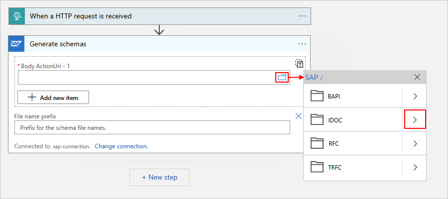
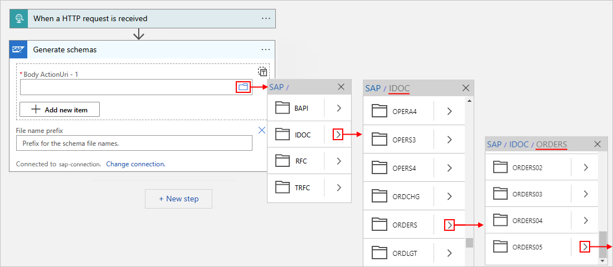
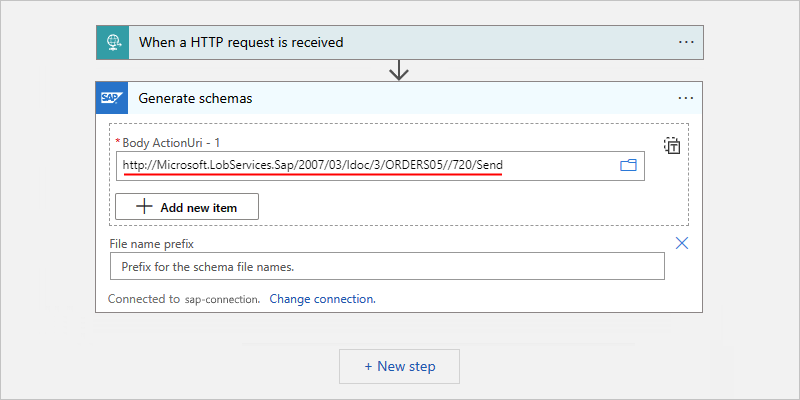
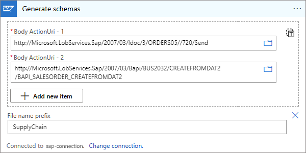
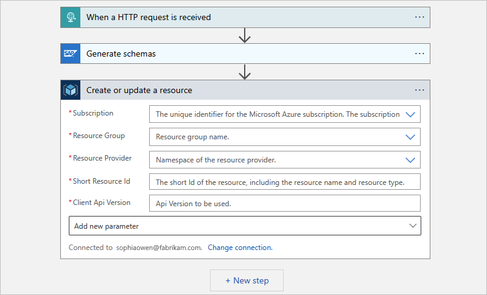
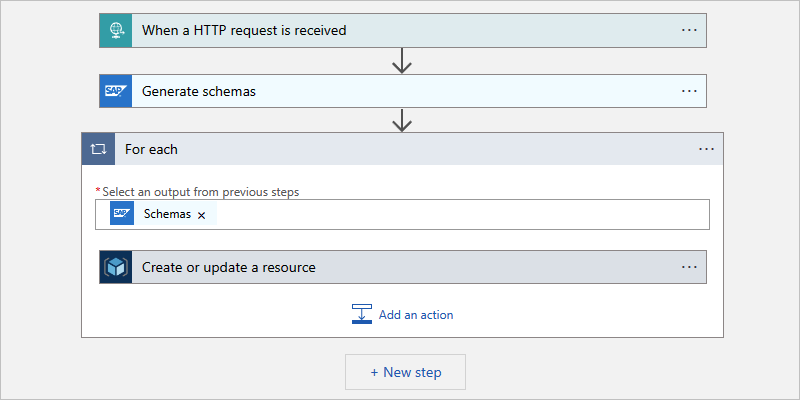

# Generate schemas for SAP artifacts in Azure Logic Apps

[!INCLUDE [logic-apps-sku-consumption-standard](../../../includes/logic-apps-sku-consumption-standard.md)]

This how-to guide shows how to create an example logic app workflow that generates schemas for SAP artifacts. The workflow starts with a **Request** trigger that can receive HTTP POST requests from your SAP server. The workflow then generates schemas for the specified IDoc and BAPI by using the SAP action named **Generate schemas** that sends a request to your SAP server. To send this request, you can use either the generic SAP managed connector action named **Send message to SAP**, or you can use the specific SAP managed or built-in action named **[BAPI] Call method in SAP**. This SAP action returns an [XML schema](#sample-xml-schemas), not the contents or data of the XML document itself. Schemas returned in the response are uploaded to an integration account by using the Azure Resource Manager connector. Schemas contain the following parts:

| Component | Description |
|-----------|-------------|
| Request message structure | Use this information to form your BAPI `get` list. |
| Response message structure | Use this information to parse the response. |

Both Standard and Consumption logic app workflows offer the SAP *managed* connector that's hosted and run in multitenant Azure. Standard workflows also offer the preview SAP *built-in* connector that's hosted and run in single-tenant Azure Logic Apps, but this connector is currently in preview and subject to the [Supplemental Terms of Use for Microsoft Azure Previews](https://azure.microsoft.com/support/legal/preview-supplemental-terms/). If you create and host a Consumption workflow in an integration service environment (ISE), you can also use the SAP connector's ISE-native version. For more information, see [Connector technical reference](sap.md#connector-technical-reference).

## Prerequisites

- Before you start, make sure to [review and meet the SAP connector requirements](sap.md#prerequisites) for your specific scenario.

- If you want to upload your generated schemas to a repository, such as an [integration account](../logic-apps-enterprise-integration-create-integration-account.md), make sure that the repository already exists.

## Generate schemas for an SAP artifact

The following example logic app workflow triggers when the workflow's SAP trigger receives a request from an SAP server. The workflow then runs an SAP action that generates schemas for the specified SAP artifact.

### Add the Request trigger

To have your workflow receive requests from your SAP server over HTTP, you can use the [Request built-in trigger](../../connectors/connectors-native-reqres.md). This trigger creates an endpoint with a URL where your SAP server can send HTTP POST requests to your workflow. When your workflow receives these requests, the trigger fires and runs the next step in your workflow.

Based on whether you have a Consumption workflow in multitenant Azure Logic Apps or a Standard workflow in single-tenant Azure Logic Apps, follow the corresponding steps:

### [Consumption](#tab/consumption)

1. In the [Azure portal](https://portal.azure.com), create a Consumption logic app resource and blank workflow, which opens in the designer.

1. In the designer, [follow these general steps to find and add the Request built-in trigger named **When a HTTP request is received**](../create-workflow-with-trigger-or-action.md?tabs=consumption#add-trigger).

   

1. Save your workflow. On the designer toolbar, select **Save**.

   This step generates an endpoint URL where your trigger can receive requests from your SAP server, for example:

   

### [Standard](#tab/standard)

1. In the [Azure portal](https://portal.azure.com), create a Standard logic app resource and a blank workflow, which opens in the designer.

1. In the designer, [follow these general steps to find and add the Request built-in trigger named **When a HTTP request is received**](../create-workflow-with-trigger-or-action.md?tabs=standard#add-trigger).

   

1. Save your workflow. On the designer toolbar, select **Save**.

   This step generates an endpoint URL where your trigger can receive requests from your SAP server, for example:

   

---

### Add an SAP action to generate schemas

Based on whether you have a Consumption workflow in multitenant Azure Logic Apps or a Standard workflow in single-tenant Azure Logic Apps, follow the corresponding steps:

### [Consumption](#tab/consumption)

1. In the workflow designer, under the Request trigger, select **New step**.

1. In the designer, [follow these general steps to find and add the SAP managed action named **Generate schemas**](../create-workflow-with-trigger-or-action.md?tabs=consumption#add-action).

   For more information about this SAP managed action, see [Generate schemas](/connectors/sap/#generate-schemas).

1. If prompted, provide the [connection information](/connectors/sap/#default-connection) for your on-premises SAP server. When you're done, select **Create**. Otherwise, continue with the next step to set up the SAP action.

   By default, when you create a connection for an SAP managed operation, strong typing is used to check for invalid values by performing XML validation against the schema. This behavior can help you detect issues earlier. Learn more about the [Safe Typing setting](sap-create-example-scenario-workflows.md#safe-typing). For other optional available connection parameters, see [Default connection information](/connectors/sap/#default-connection).

   After Azure Logic Apps sets up and tests your connection, the action information box appears. For more information about any connection problems that might happen, see [Troubleshoot connections](sap-create-example-scenario-workflows.md#troubleshoot-connections).

   

1. In the [**Generate schemas** action](/connectors/sap/#generate-schemas), provide a path to the artifact for which you want to generate the schema by selecting an available SAP action on your SAP server.

   1. In the **Body ActionUri** parameter's edit box, select the folder icon. From the list that opens, select **BAPI**, **IDOC**, **RFC**, or **TRFC**. This example selects **IDOC**. If you select a different type, the available SAP actions change based on your selection.

      > [!NOTE]
      >
      > If you get a **Bad Gateway (500)** error or **Bad request (400)** error, see [500 Bad Gateway or 400 Bad Request error](sap-create-example-scenario-workflows.md#bad-gateway-request).

      

   1. Browse the SAP action types folders using the arrows to find and select the SAP action that you want to use.

      This example selects **ORDERS** > **ORDERS05** > **720** > **Send**.

      

      If you can't find the action you want, you can manually enter a path, for example:

      

      > [!TIP]
      >
      > For the **Body ActionUri** parameter, you can use the expression editor to provide the parameter value. 
      > That way, you can use the same SAP action for different message types.

      For more information about this SAP action, see [Message schemas for IDoc operations](/biztalk/adapters-and-accelerators/adapter-sap/message-schemas-for-idoc-operations).

   1. To generate schemas for more than one artifact, in the **Body ActionUri** section, select **Add new item**.

      

   1. For each artifact, provide the SAP action that you want to use for schema generation, for example:

      

1. Save your workflow. On the designer toolbar, select **Save**.

### [Standard](#tab/standard)

1. In the workflow designer, under the Request trigger, select the plus sign (**+**) > **Add an action**.

1. In the designer, [follow these general steps to find and add the SAP built-in action named **Generate Schema**](../create-workflow-with-trigger-or-action.md?tabs=standard#add-action).

   For more information about this SAP built-in action, see [Generate Schema](/azure/logic-apps/connectors/built-in/reference/sap/#generate-schema-(preview)).

1. If prompted, provide the following connection information for your on-premises SAP server. When you're done, select **Create**. Otherwise, continue with the next step to set up the SAP action.

   | Parameter | Required | Description |
   |-----------|----------|-------------|
   | **Connection name** | Yes | Enter a name for the connection. |
   | **Client** | Yes | The SAP client ID to use for connecting to your SAP server |
   | **Authentication Type** | Yes | The authentication type to use for your connection. To create an SNC connection, see [Enable Secure Network Communications (SNC)](sap.md?tabs=single-tenant#enable-secure-network-communications). |
   | **SAP Username** | Yes | The username for your SAP server |
   | **SAP Password** | Yes | The password for your SAP server |
   | **Logon Type** | Yes | Select either **Application Server** or **Group**, and then configure the corresponding required parameters, even though they appear optional: <br><br>**Application Server**: <br>- **Server Host**: The host name for your SAP Application Server <br>- **Service**: The service name or port number for your SAP Application Server <br>- **System Number**: Your SAP server's system number, which ranges from 00 to 99 <br><br>**Group**: <br>- **Server Host**: The host name for your SAP Message Server <br>- **Service Name or Port Number**: The service name or port number for your SAP Message Server <br>- **System ID**: The system ID for your SAP server <br>- **Logon Group**: The logon group for your SAP server. On your SAP server, you can find or edit the **Logon Group** value by opening the **CCMS: Maintain Logon Groups** (T-Code SMLG) dialog box. For more information, review [SAP Note 26317 - Set up for LOGON group for automatic load balancing](https://service.sap.com/sap/support/notes/26317). |
   | **Language** | Yes | The language to use for sending data to your SAP server. The value is either **Default** (English) or one of the [permitted values](/azure/logic-apps/connectors/built-in/reference/sap/#parameters-21). <br><br>**Note**: The SAP built-in connector saves this parameter value as part of the SAP connection parameters. For more information, see [Change language headers for sending data to SAP](sap-create-example-scenario-workflows.md#change-language-headers). |

   After Azure Logic Apps sets up and tests your connection, the action information box appears. For more information about any connection problems that might happen, see [Troubleshoot connections](sap-create-example-scenario-workflows.md#troubleshoot-connections).

   

   > [!NOTE]
   >
   > If you get a **Bad Gateway (500)** error or **Bad request (400)** error, see [500 Bad Gateway or 400 Bad Request error](sap-create-example-scenario-workflows.md#bad-gateway-request).

1. In the [**Generate Schema** action](/azure/logic-apps/connectors/built-in/reference/sap/#generate-schema-(preview)), provide the following information about the artifact for which to generate the schema.

   This action's parameters change based on the **Operation Type** value that you select.

   | Parameter | Required | Value | Description |
   |-----------|----------|-------|-------------|
   | **Operation Type** | Yes | **BAPI**, **RFC**, **IDoc**, **RFC**, or **tRFC** | The operation type to use for the schema generation. This example selects and continues with **IDoc**. |
   | **IDoc Type** | Yes | <*IDoc-type*> | Select the IDoc type to use for schema generation. This example selects **ORDERS05**. |
   | **Release** | Yes | <*IDoc-release-number*> | Select the IDoc release number. This example selects **720**. |
   | **Version** | Yes | <*IDoc-release-version*> | Select the IDoc release version. This example selects **3**. |
   | **Direction** | Yes | <*request-direction*> | Select the direction for the request. This example selects **Send**. |

   

   For more information schemas for this SAP action, see [Message schemas for IDoc operations](/biztalk/adapters-and-accelerators/adapter-sap/message-schemas-for-idoc-operations).

1. Save your workflow. On the designer toolbar, select **Save**.

---

<a name="test-workflow"></a>

### Test your workflow for schema generation

Based on whether you have a Consumption workflow in multitenant Azure Logic Apps or a Standard workflow in single-tenant Azure Logic Apps, follow the corresponding steps:

### [Consumption](#tab/consumption)

1. If your Consumption logic app resource isn't already enabled, on your logic app menu, select **Overview**. On the toolbar, select **Enable**.

1. On the designer toolbar, select **Run Trigger** > **Run** to manually start your workflow.

1. To simulate a webhook trigger payload, send an HTTP POST request to the endpoint URL that's specified by your workflow's Request trigger. To send the request, use a local tool or app such as [Insomnia](https://insomnia.rest/) or [Bruno](https://www.usebruno.com/).

   For this example, the HTTP POST request sends an IDoc file, which must be in XML format and include the namespace for the SAP action that you selected, for example:

   ```xml
   <?xml version="1.0" encoding="UTF-8" ?>
   <Send xmlns="http://Microsoft.LobServices.Sap/2007/03/Idoc/2/ORDERS05//720/Send">
     <idocData>
       <...>
     </idocData>
   </Send>
   ```

1. After you send your HTTP request, wait for the response from your workflow.

   > [!NOTE]
   >
   > Your workflow might time out if all the steps required for the response don't finish within the [request timeout limit](../logic-apps-limits-and-config.md). 
   > If this condition happens, requests might get blocked. To help you diagnose problems, learn how you can [check and monitor your logic app workflows](../monitor-logic-apps.md).

1. On your logic app's **Overview** pane, under **Runs history**, find and open the workflow run.

1. Find the **Generate schemas** action, and review the action's outputs.

   The outputs show the generated schemas for the specified messages.

For more information about reviewing workflow run history, see [Monitor logic app workflows](../monitor-logic-apps.md?tabs=consumption).

### [Standard](#tab/standard)

1. If your Standard logic app resource is stopped or disabled, from your workflow, go to the logic app resource level, and select **Overview**. On the toolbar, select **Start**.

1. Return to the workflow level. On the workflow menu, select **Overview**. On the toolbar, select **Run** > **Run** to manually start your workflow.

1. To simulate a webhook trigger payload, send an HTTP POST request to the endpoint URL that's specified by your workflow's Request trigger. To send the request, use a local tool or app such as [Insomnia](https://insomnia.rest/) or [Bruno](https://www.usebruno.com/).

   For this example, the HTTP POST request sends an IDoc file, which must be in XML format and include the namespace for the SAP action that you selected, for example:

   ```xml
   <?xml version="1.0" encoding="UTF-8" ?>
   <Send xmlns="http://Microsoft.LobServices.Sap/2007/03/Idoc/2/ORDERS05//720/Send">
     <idocData>
       <...>
     </idocData>
   </Send>
   ```

1. After you send the HTTP request, wait for the response from your workflow.

   > [!NOTE]
   >
   > Your workflow might time out if all the steps required for the response don't finish within the [request timeout limit](../logic-apps-limits-and-config.md). 
   > If this condition happens, requests might get blocked. To help you diagnose problems, learn [how to check and monitor your logic app workflows](../monitor-logic-apps.md).

1. On your workflow's **Overview** pane, under **Run History**, find and open the workflow run.

1. Find the **Generate Schema** action, and review the action's outputs.

   The outputs show the generated schemas for the specified messages.

For more information about reviewing workflow run history, see [Monitor logic app workflows](../monitor-logic-apps.md?tabs=standard).

---

## Upload schemas to an integration account

Optionally, you can download or store the generated schemas in repositories, such as an [integration account](../logic-apps-enterprise-integration-create-integration-account.md) or Azure storage account, for example, in a blob container. Integration accounts provide a first-class experience with XML actions for workflows in Azure Logic Apps. You have the option to upload generated schemas to an existing integration account within the same workflow that generates those schemas by using the Azure Resource Manager action named **Create or update a resource**.

> [!NOTE]
>
> Schemas use base64-encoded format. To upload schemas to an integration account, you must decode them first 
> by using the `base64ToString()` function. The following example shows the code for the `properties` element:
>
> ```json
> "properties": {
>    "Content": "@base64ToString(items('For_each')?['Content'])",
>    "ContentType": "application/xml",
>    "SchemaType": "Xml"
> }
> ```

For this task, you'll need an [integration account](../logic-apps-enterprise-integration-create-integration-account.md), if you don't already have one. Based on whether you have a Consumption workflow in multitenant Azure Logic Apps or a Standard workflow in single-tenant Azure Logic Apps, follow the corresponding steps to upload schemas to an integration account from your workflow after schema generation.

### [Consumption](#tab/consumption)

1. In the workflow designer, under the SAP managed action named **Generate schemas**, select **New step**.

1. [Follow these general steps to find and add the Azure Resource Manager managed action named **Create or update a resource**](../create-workflow-with-trigger-or-action.md?tabs=consumption#add-action). If you're prompted to sign in with your credentials, go ahead and continue.

   After Azure Logic Apps sets up and tests your connection, the action information box appears.

   

1. In the **Create or update a resource** action, provide the [required information](/connectors/arm/#create-or-update-a-resource).

   1. To include any outputs from previous steps in the workflow, select inside the parameter where you want to include the output, open the dynamic content list, and select the output to include.

   1. From the **Add new parameter** list, select the **Location** and **Properties** parameters.

   1. Provide the values for these added parameters, for example:

      

   The **Generate schemas** action generates schemas as a collection, so the designer automatically adds a **For each** loop around the Azure Resource Manager action, for example:

   

1. Save your workflow. On the designer toolbar, select **Save**.

### [Standard](#tab/standard)

1. In the workflow designer, under the SAP built-in action named **Generate Schema**, select the plus sign (**+**) > **Add an action**.

1. [Follow these general steps to find and add the Azure Resource Manager managed action named **Create or update a resource**](../create-workflow-with-trigger-or-action.md?tabs=standard#add-action). If you're prompted to sign in with your credentials, go ahead and continue.

   After Azure Logic Apps sets up and tests your connection, the action information box appears.

   

1. In the **Create or update a resource** action, provide the [required information](/connectors/arm/#create-or-update-a-resource).

   1. To include any outputs from previous steps in the workflow, select inside the parameter where you want to include the output, open the dynamic content list, and select the output to include.

   1. From the **Add new parameter** list, select the **Location** and **Properties** parameters.

   1. Provide the values for these added parameters, for example:

      

   The **Generate Schema** action generates schemas as a collection, so the designer automatically adds a **For each** loop around the Azure Resource Manager action, for example:

   

1. Save your workflow. On the designer toolbar, select **Save**.

---

### Test your workflow

1. Based on whether you have a Consumption or Standard logic app workflow, [follow the general steps to manually test and run your workflow](#test-workflow).

1. After a successful run, go to the integration account, and check that the generated schemas exist.

## Sample XML schemas

If you're learning how to generate an XML schema for use in creating a sample document, review the following samples. These examples show how you can work with many types of payloads, including:

* [RFC requests](#xml-samples-for-rfc-requests)
* [BAPI requests](#xml-samples-for-bapi-requests)
* [IDoc requests](#xml-samples-for-idoc-requests)
* Simple or complex XML schema data types
* Table parameters
* Optional XML behaviors

You can begin your XML schema with an optional XML prolog. The SAP connector works with or without the XML prolog.

```xml
<?xml version="1.0" encoding="utf-8">
```

### XML samples for RFC requests

The following example shows a basic RFC call where the RFC name is `STFC_CONNECTION`. This request uses the default namespace named `xmlns=`. However, you can assign and use namespace aliases such as `xmmlns:exampleAlias=`. The namespace value is the namespace for all the RFCs in SAP for Microsoft services. The request has a simple input parameter named `<REQUTEXT>`.

```xml
<STFC_CONNECTION xmlns="http://Microsoft.LobServices.Sap/2007/03/Rfc/">
   <REQUTEXT>exampleInput</REQUTEXT>
</STFC_CONNECTION>
```

The following example shows an RFC call with a table parameter. This example call and group of test RFCs are available in all SAP systems. The table parameter is named `TCPICDAT`. The table line type is `ABAPTEXT`, and this element repeats for each row in the table. This example contains a single line, which is named `LINE`. Requests with a table parameter can contain any number of fields, where the number is a positive integer (*n*). 

```xml
<STFC_WRITE_TO_TCPIC xmlns="http://Microsoft.LobServices.Sap/2007/03/Rfc/">
   <RESTART_QNAME>exampleQName</RESTART_QNAME>
   <TCPICDAT>
      <ABAPTEXT xmlns="http://Microsoft.LobServices.Sap/2007/03/Types/Rfc/">
         <LINE>exampleFieldInput1</LINE>
      </ABAPTEXT>
      <ABAPTEXT xmlns="http://Microsoft.LobServices.Sap/2007/03/Types/Rfc/">
         <LINE>exampleFieldInput2</LINE>
      </ABAPTEXT>
      <ABAPTEXT xmlns="http://Microsoft.LobServices.Sap/2007/03/Types/Rfc/">
         <LINE>exampleFieldInput3</LINE>
      </ABAPTEXT>
   </TCPICDAT>
</STFC_WRITE_TO_TCPIC>
```

> [!TIP]
>
> To review the result from RFC **STFC_WRITE_TO_TCPIC**, use the SAP Logon's Data Browser (T-Code SE16) and the table named **TCPIC**.

The following example shows an RFC call with a table parameter that has an anonymous field, which is a field without an assigned name. Complex types are declared under a separate namespace where the declaration sets a new default for the current node and all its child elements. The example uses the hex code `x002F` as an escape character for the symbol */* because this symbol is reserved in the SAP field name.

```xml
<RFC_XML_TEST_1 xmlns="http://Microsoft.LobServices.Sap/2007/03/Rfc/">
   <IM_XML_TABLE>
      <RFC_XMLCNT xmlns="http://Microsoft.LobServices.Sap/2007/03/Rfc/">
         <_x002F_AnonymousField>AQIDBAU=</_x002F_AnonymousField>
      </RFC_XMLCNT>
   </IM_XML_TABLE>
</RFC_XML_TEST_1>
```

The previous example also shows how to encode binary arrays for the SAP data types `byte` and `XString`. The binary arrays are base64 encoded in XML (XSD binary data type `xs:base64Binary`). In the example, the sample base64 string value `AQIDBAU=` decodes as the binary array `[01][02][03][04]`. This encoding differs and is more space-efficient than the hex encoding of the underlying SAP .NET Connector. With hex encoding, the same value is encoded as the string `01020304`. 

> [!NOTE]
> Use caution when using binary array encoding because hex encoding uses a subset of the base64 range and 
> appears as valid base64 values. For example, the string value `01020304` also decodes as a valid base64 
> encoded value, but results in a different binary array `[d3][5d][36][d3][7d][38]`, not binary array `[01][02][03][04]`.

The following example includes prefixes for the namespaces. You can declare all prefixes at once, or you can declare any number of prefixes as attributes of a node. The RFC namespace alias named `ns0` is used as the root and parameters for the basic type.

> [!NOTE]
>
> Complex types are declared under a different namespace for RFC types with 
> the alias `ns3` instead of the regular RFC namespace with the alias `ns0`.

```xml
<ns0:BBP_RFC_READ_TABLE xmlns:ns0="http://Microsoft.LobServices.Sap/2007/03/Rfc/" xmlns:ns3="http://Microsoft.LobServices.Sap/2007/03/Types/Rfc/">
   <ns0:DELIMITER>0</ns0:DELIMITER>
   <ns0:QUERY_TABLE>KNA1</ns0:QUERY_TABLE>
   <ns0:ROWCOUNT>250</ns0:ROWCOUNT>
   <ns0:ROWSKIPS>0</ns0:ROWSKIPS>
   <ns0:FIELDS>
      <ns3:RFC_DB_FLD>
         <ns3:FIELDNAME>KUNNR</ns3:FIELDNAME>
      </ns3:RFC_DB_FLD>
   </ns0:FIELDS>
</ns0:BBP_RFC_READ_TABLE>
```

#### XML samples for BAPI requests

The following XML samples are example requests to [call the BAPI method](/connectors/sap/#[bapi]-call-method-in-sap-(preview)).

> [!NOTE]
> SAP makes business objects available to external systems by describing them in response to RFC `RPY_BOR_TREE_INIT`, 
> which Azure Logic Apps issues without an input filter. Azure Logic Apps inspects the output table `BOR_TREE`. 
> The `SHORT_TEXT` field is used for names of business objects. Business objects not returned by SAP in the output 
> table aren't accessible to Azure Logic Apps.
> 
> If you use custom business objects, make sure to publish and release these business objects in SAP. Otherwise, 
> SAP doesn't list your custom business objects in the output table `BOR_TREE`. You can't access your custom 
> business objects in Azure Logic Apps until you expose the business objects from SAP.

The following example gets a list of banks using the BAPI method `GETLIST`. This sample contains the business object for a bank named `BUS1011`.

```xml
<GETLIST xmlns="http://Microsoft.LobServices.Sap/2007/03/Bapi/BUS1011">
   <BANK_CTRY>US</BANK_CTRY>
   <MAX_ROWS>10</MAX_ROWS>
</GETLIST>
```

The following example creates a bank object using the `CREATE` method. This example uses the same business object named `BUS1011`, as the previous example. When you use the `CREATE` method to create a bank, make sure to commit your changes because this method isn't committed by default.

> [!TIP]
>
> Make sure that your XML document follows any validation rules configured in your SAP system. For example, for this 
> sample document, in the USA, the bank key (`<BANK_KEY>`) must be a bank routing number, also known as an ABA number.

```xml
<CREATE xmlns="http://Microsoft.LobServices.Sap/2007/03/Bapi/BUS1011">
   <BANK_ADDRESS>
      <BANK_NAME xmlns="http://Microsoft.LobServices.Sap/2007/03/Types/Rfc">ExampleBankName</BANK_NAME>
      <REGION xmlns="http://Microsoft.LobServices.Sap/2007/03/Types/Rfc">ExampleRegionName</REGION>
      <STREET xmlns="http://Microsoft.LobServices.Sap/2007/03/Types/Rfc">ExampleStreetAddress</STREET>
      <CITY xmlns="http://Microsoft.LobServices.Sap/2007/03/Types/Rfc">Redmond</CITY>
   </BANK_ADDRESS>
   <BANK_CTRY>US</BANK_CTRY>
   <BANK_KEY>123456789</BANK_KEY>
</CREATE>
```

The following example gets details for a bank using the bank routing number, which is the value for `<BANK_KEY>`.

```xml
<GETDETAIL xmlns="http://Microsoft.LobServices.Sap/2007/03/Bapi/BUS1011">
   <BANKCOUNTRY>US</BANKCOUNTRY>
   <BANKKEY>123456789</BANKKEY>
</GETDETAIL>
```

### XML samples for IDoc requests

To generate a plain SAP IDoc XML schema, use the **SAP Logon** application and the `WE60` T-Code. Access the SAP documentation through the user interface, and generate XML schemas in XSD format for your IDoc types and extensions. For more information about generic SAP formats and payloads, and their built-in dialogs, review the [SAP documentation](https://help.sap.com/viewer/index).

This example declares the root node and namespaces. The URI in the sample code, `http://Microsoft.LobServices.Sap/2007/03/Idoc/3/ORDERS05//700/Send`, declares the following configuration:

* `/IDoc` is the root node for all IDocs.

* `/3` is the record types version for common segment definitions.

* `/ORDERS05` is the IDoc type.

* `//` is an empty segment because there's no IDoc extension.

* `/700` is the SAP version.

* `/Send` is the action to send the information to SAP.

```xml
<ns0:Send xmlns:ns0="http://Microsoft.LobServices.Sap/2007/03/Idoc/3/ORDERS05//700/Send" xmlns:ns3="http://schemas.microsoft.com/2003/10/Serialization" xmlns:ns1="http://Microsoft.LobServices.Sap/2007/03/Types/Idoc/Common/" xmlns:ns2="http://Microsoft.LobServices.Sap/2007/03/Idoc/3/ORDERS05//700">
   <ns0:idocData>
```

You can repeat the `idocData` node to send a batch of IDocs in a single call. In the following example, there's one control record named `EDI_DC40`, and multiple data records.

```xml
<...>
   <ns0:idocData>
      <ns2:EDI_DC40>
         <ns1:TABNAM>EDI_DC40</ns1:TABNAM>
         <...>
         <ns1:ARCKEY>Cor1908207-5</ns1:ARCKEY>
      </ns2:EDI_DC40>
      <ns2:E2EDK01005>
         <ns2:DATAHEADERCOLUMN_SEGNAM>E23DK01005</ns2:DATAHEADERCOLUMN_SEGNAM>
         <ns2:CURCY>USD</ns2:CURCY>
      </ns2:E2EDK01005>
      <ns2:E2EDK03>
      <...>
   </ns0:idocData>
```

The following example shows a sample IDoc control record, which uses a prefix named `EDI_DC`. You must update the values to match your SAP installation and IDoc type. For example, your IDoc client code might not be `800`. Contact your SAP team to make sure you're using the correct values for your SAP installation.

```xml
<ns2:EDI_DC40>
   <ns:TABNAM>EDI_DC40</ns1:TABNAM>
   <ns:MANDT>800</ns1:MANDT>
   <ns:DIRECT>2</ns1:DIRECT>
   <ns:IDOCTYP>ORDERS05</ns1:IDOCTYP>
   <ns:CIMTYP></ns1:CIMTYP>
   <ns:MESTYP>ORDERS</ns1:MESTYP>
   <ns:STD>X</ns1:STD>
   <ns:STDVRS>004010</ns1:STDVRS>
   <ns:STDMES></ns1:STDMES>
   <ns:SNDPOR>SAPENI</ns1:SNDPOR>
   <ns:SNDPRT>LS</ns1:SNDPRT>
   <ns:SNDPFC>AG</ns1:SNDPFC>
   <ns:SNDPRN>ABAP1PXP1</ns1:SNDPRN>
   <ns:SNDLAD></ns1:SNDLAD>
   <ns:RCVPOR>BTSFILE</ns1:RCVPOR>
   <ns:RCVPRT>LI</ns1:RCVPRT>
```

The following example shows a sample data record with plain segments. This example uses the SAP date format. Strong-typed documents can use native XML date formats, such as `2020-12-31 23:59:59`.

```xml
<ns2:E2EDK01005>
   <ns2:DATAHEADERCOLUMN_SEGNAM>E2EDK01005</ns2:DATAHEADERCOLUMN_SEGNAM>
      <ns2:CURCY>USD</ns2:CURCY>
      <ns2:BSART>OR</ns2:BSART>
      <ns2:BELNR>1908207-5</ns2:BELNR>
      <ns2:ABLAD>CC</ns2:ABLAD>
   </ns2>
   <ns2:E2EDK03>
      <ns2:DATAHEADERCOLUMN_SEGNAM>E2EDK03</ns2:DATAHEADERCOLUMN_SEGNAM>
      <ns2:IDDAT>002</ns2:IDDAT>
      <ns2:DATUM>20160611</ns2:DATUM>
   </ns2:E2EDK03>
```

The following example shows a data record with grouped segments. The record includes a group parent node named `E2EDKT1002GRP`, and multiple child nodes, including `E2EDKT1002` and `E2EDKT2001`. 

```xml
<ns2:E2EDKT1002GRP>
   <ns2:E2EDKT1002>
      <ns2:DATAHEADERCOLUMN_SEGNAM>E2EDKT1002</ns2:DATAHEADERCOLUMN_SEGNAM>
         <ns2:TDID>ZONE</ns2:TDID>
   </ns2:E2EDKT1002>
   <ns2:E2EDKT2001>
      <ns2:DATAHEADERCOLUMN_SEGNAM>E2EDKT2001</ns2:DATAHEADERCOLUMN_SEGNAM>
         <ns2:TDLINE>CRSD</ns2:TDLINE>
   </ns2:E2EDKT2001>
</ns2:E2EDKT1002GRP>
```

The recommended method is to create an IDoc identifier for use with tRFC. You can set this transaction identifier named `tid` using the [Send IDoc operation](/connectors/sap/#send-idoc) in the SAP managed connector.

The following example shows an alternative method to set the transaction identifier, or `tid`. In this example, the last data record segment node and the IDoc data node are closed. Then, the GUID, `guid`, is used as the tRFC identifier to detect duplicates.

```xml
     </E2STZUM002GRP>
  </idocData>
  <guid>8820ea40-5825-4b2f-ac3c-b83adc34321c</guid>
</Send>
```

## Next steps

* [Create example workflows for common SAP scenarios](sap-create-example-scenario-workflows.md)
