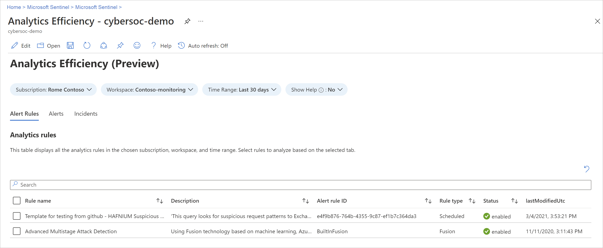
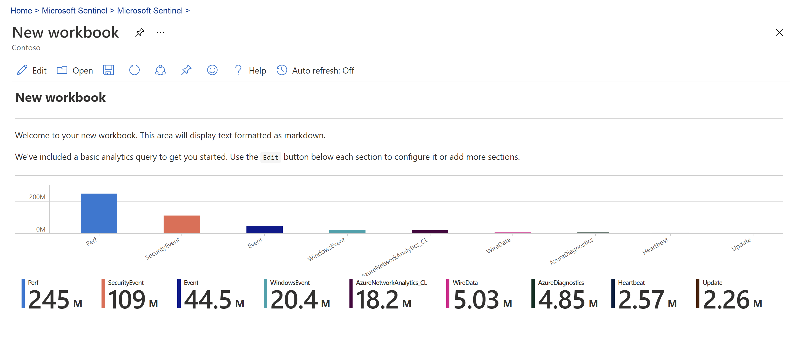

# Visualize and monitor your data by using workbooks in Microsoft Sentinel

After you connect your data sources to Microsoft Sentinel, visualize and monitor the data using workbooks in Microsoft Sentinel. Microsoft Sentinel allows you to create custom workbooks across your data or, use existing workbook templates available with packaged solutions or as standalone content from the content hub. These templates allow you to quickly gain insights across your data as soon as you connect a data source.

This article describes how to visualize your data in Microsoft Sentinel by using workbooks.

[!INCLUDE [unified-soc-preview](includes/unified-soc-preview.md)]

## Prerequisites

- You must have at least **Workbook reader** or **Workbook contributor** permissions on the resource group of the Microsoft Sentinel workspace.

   The workbooks that you see in Microsoft Sentinel are saved within the Microsoft Sentinel workspace's resource group and are tagged by the workspace in which they were created.
- To use a workbook template, install the solution that contains the workbook or install the workbook as a standalone item from the **Content Hub**. For more information, see [Discover and manage Microsoft Sentinel out-of-the-box content](sentinel-solutions-deploy.md).
 
## Create a workbook from a template

Use a template installed from the content hub to create a workbook.

1. For Microsoft Sentinel in the [Azure portal](https://portal.azure.com), under **Threat management**, select **Workbooks**.  For Microsoft Sentinel in the [Defender portal](https://security.microsoft.com/), select **Microsoft Sentinel** > **Threat management** > **Workbooks**.

1. Go to **Workbooks** and then select **Templates** to see the list of workbook templates installed.

    To see which templates are relevant to the data types you connected, review the **Required data types** field in each workbook where available.

    #### [Azure portal](#tab/azure-portal)
    :::image type="content" source="media/monitor-your-data/workbook-template-azure-portal.png" alt-text="Screenshot of a workbook template with required data types shown in the details pane." lightbox="media/monitor-your-data/workbook-template-azure-portal.png":::

    #### [Defender portal](#tab/defender-portal)
    :::image type="content" source="media/monitor-your-data/workbook-template-defender-portal.png" alt-text="Screenshot of a workbook template in the Defender portal that shows the required data types." lightbox="media/monitor-your-data/workbook-template-defender-portal.png":::

1. Select **Save** from the template details pane and the location where you want to save the JSON file for the template. This action creates an Azure resource based on the relevant template and saves the JSON file of the workbook not the data.

1. Select **View saved workbook** from the template details pane. 

1. Select the **Edit** button in the workbook toolbar to customize the workbook according to your needs.

    

   To clone your workbook, select **Edit** and then **Save as**. Save the clone with another name, under the same subscription and resource group. Cloned workbooks are displayed under the **My workbooks** tab.

1. When you're done, select **Save** to save your changes.

For more information, see how to [Create interactive reports with Azure Monitor Workbooks](../azure-monitor/visualize/workbooks-overview.md).

## Create new workbook

Create a workbook from scratch in Microsoft Sentinel.

1. For Microsoft Sentinel in the [Azure portal](https://portal.azure.com), under **Threat management**, select **Workbooks**.  For Microsoft Sentinel in the [Defender portal](https://security.microsoft.com/), select **Microsoft Sentinel** > **Threat management** > **Workbooks**.
1. Select **Add workbook**.
1. To edit the workbook, select **Edit**, and then add text, queries, and parameters as necessary. For more information on how to customize the workbook, see how to [Create interactive reports with Azure Monitor Workbooks](../azure-monitor/visualize/workbooks-overview.md). 

    

1. When building a query, set the **Data source** to **Logs** and **Resource type** to **Log Analytics**, and then choose one or more workspaces.

   We recommend that your query uses an [Advanced Security Information Model (ASIM) parser](normalization-about-parsers.md) and not a built-in table. The query will then support any current or future relevant data source rather than a single data source.
 
1. After you create your workbook, save the workbook under the subscription and resource group of your Microsoft Sentinel workspace.

1. If you want to let others in your organization use the workbook, under **Save to** select **Shared reports**. If you want this workbook to be available only to you, select **My reports**.

1. To switch between workbooks in your workspace, select **Open**  in the toolbar of any workbook. The screen switches to a list of other workbooks you can switch to.

    Select the workbook you want to open:

    

## Refresh your workbook data

Refresh your workbook to display updated data. In the toolbar, select one of the following options:

- :::image type="icon" source="media/monitor-your-data/manual-refresh-button.png" border="false"::: **Refresh**, to manually refresh your workbook data.

- :::image type="icon" source="media/monitor-your-data/auto-refresh-workbook.png" border="false"::: **Auto refresh**, to set your workbook to automatically refresh at a configured interval.

    - Supported auto refresh intervals range from **5 minutes** to **1 day**.

    - Auto refresh is paused while you're editing a workbook, and intervals are restarted each time you switch back to view mode from edit mode.

    - Auto refresh intervals are also restarted if you manually refresh your data.

    By default, auto refresh is turned off. To optimize performance, auto refresh is turned off each time you close a workbook. It doesn't run in the background. Turn auto refresh back on as needed the next time you open the workbook.

## Print a workbook or save as PDF

To print a workbook, or save it as a PDF, use the options menu to the right of the workbook title.

1. Select options > :::image type="icon" source="media/monitor-your-data/print-icon.png" border="false"::: **Print content**. 
2. In the print screen, adjust your print settings as needed or select **Save as PDF** to save it locally.

   For example:
   :::image type="content" source="media/monitor-your-data/print-workbook.png" alt-text="Screenshot that shows how to print your workbook or save as PDF." :::

## How to delete workbooks

To delete a saved workbook, either a saved template or a customized workbook, select the saved workbook that you want to delete and select **Delete**. This action removes the saved workbook. It also removes the workbook resource and any changes you made to the template. The original template remains available.

## Related articles

To learn about popular built-in workbooks, see [Commonly used Microsoft Sentinel workbooks](top-workbooks.md). 
