# Azure Time Series Insights Explorer

[!INCLUDE [retirement](../../includes/tsi-retirement.md)]

This article describes the various features and options available within the Azure Time Series Insights Gen2 Demo environment.

## Prerequisites

To get started with the Azure Time Series Insights Explorer, you must:

* Have an Azure Time Series Insights Gen2 environment provisioned. Learn more about provisioning an instance by reading the [Azure Time Series Insights Gen2](./tutorial-set-up-environment.md) tutorial.
* [Provide data access](./concepts-access-policies.md) to the Azure Time Series Insights Gen2 environment that you created for the account. You can provide access to others as well as to yourself.
* Add an event source to the Azure Time Series Insights Gen2 environment to push data to the environment:
  * Learn [how to connect to an event hub](./how-to-ingest-data-event-hub.md)
  * Learn [how to connect to an IoT hub](./how-to-ingest-data-iot-hub.md)

## Explore the Azure Time Series Insights Explorer

The Azure Time Series Insights Explorer consists of the following seven elements:

[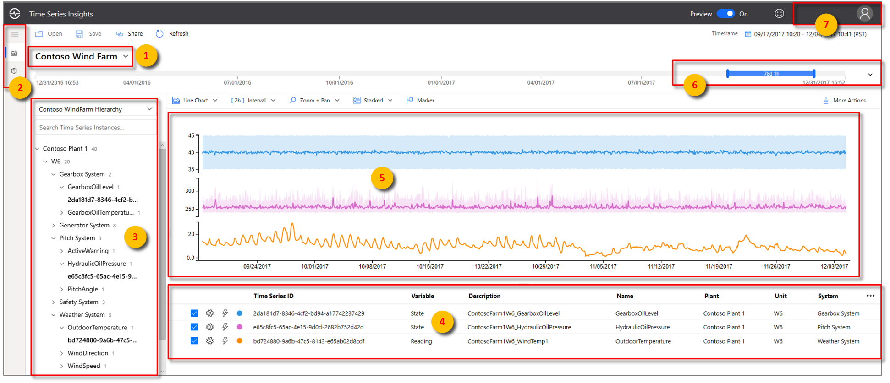](media/v2-update-explorer/preview-explorer-overview.png#lightbox)

1. [Environment panel](#1-environment-panel): Displays all your Azure Time Series Insights Gen2 environments.
1. [Navigation bar](#2-navigation-bar): Lets you switch between the **Analyze** and **Model** pages.
1. [Hierarchy tree and search panel](#3-hierarchy-tree-and-search-panel): Lets you select and search for specific data elements to be charted.
1. [Time series well](#4-time-series-well): Shows all your currently selected data elements.
1. [Chart panel](#5-chart-panel): Displays your current working chart.
1. [Timeline](#6-time-editor-panel): Lets you modify your working time span.
1. [App bar](#7-app-bar): Contains your user management options (such as current tenant), and allows you to change them and language settings.

## 1. Environment panel

The environment panel displays all the Azure Time Series Insights Gen2 environments you have access to. The list includes Gen2 environments as well as Gen1 environments. Simply select the environment you want to use to immediately be taken there.

1. Select the drop-down arrow next to your displayed environment.

   [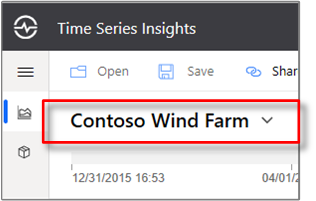](media/v2-update-explorer/environment-panel.png#lightbox)

1. Then, select the environment you want.

## 2. Navigation bar

  [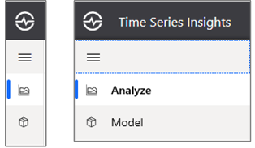](media/v2-update-explorer/tsi-preview-navigation-bar.png#lightbox)

Use the navigation bar to select between two views:

* **Analyze**: Use it to chart and perform rich analytics on your modeled or unmodeled time series data.
* **Model**: Use it to push new Azure Time Series Insights Gen2 types, hierarchies, and instances to your Time Series Model.

### Model authoring

The Azure Time Series Insights Gen2 supports full create, read, update, and delete (CRUD) operations on your Time Series Model.

[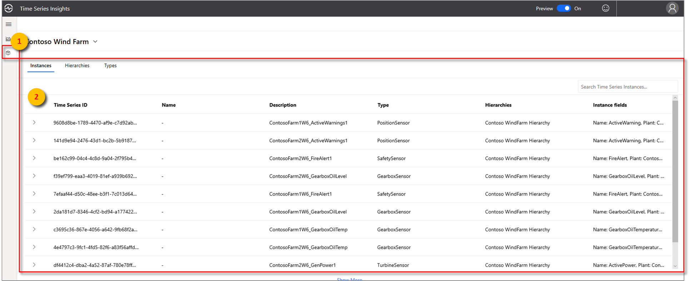](media/v2-update-explorer/model-search-panel.png#lightbox)

* **Time Series Model type**: You can use Time Series Model types to define variables or formulas for doing computations. They're associated with a given Time Series Model instance. A type can have one or more variables.
* **Time Series Model hierarchy**: Hierarchies are systematic organizations of your data. Hierarchies depict the relationships between different instances in your Time Series Model.
* **Time Series Model instance**: Instances are the time series themselves. In most cases, they're the **DeviceID** or **AssetID**, which is the unique identifier of the asset in the environment.

To learn more about the Time Series Model, read [Times Series Models](./concepts-model-overview.md).

## 3. Hierarchy tree and search panel

The hierarchy tree and search panel allow you to easily search and navigate your [Time Series Model](./concepts-model-overview.md) hierarchy to find the specific time series instances you want to display on your chart. When you select your instances, they are not only added to the current chart but are also added to the data well.

[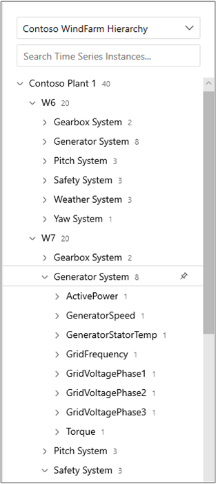](media/v2-update-explorer/tsi-preview-explorer-hierarchy-search.png#lightbox)

The search results pane also lets you view your results in a hierarchy view or a list view making it easy to find the instances you want to display.

## 4. Time series well

The well displays instance fields and other metadata associated with selected Time Series Model instances. By selecting the check boxes on the right side, you can hide or display specific instances from the current chart.

  

You may remove specific data elements from your current data well by selecting the red **Delete** (trash can) control on the left side of the element. The well also lets you control how each element is displayed in the chart. You can choose to add min/max shadows, data points, shift the element in time and visualize the instance a stepped manner.

Additionally, The explorations control lets you create time shifts and scatter plots easily.

  [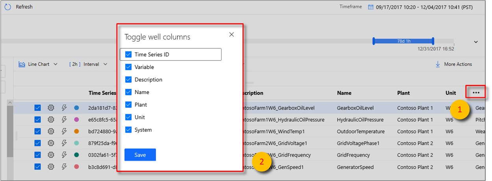](media/v2-update-explorer/well-layout-options.png#lightbox)

> [!NOTE]
> If the following message appears, the instance doesn't have any data during the time span selected. To resolve the issue, increase the time span or confirm that the instance is pushing data.
>
> 

## 5. Chart panel

The chart enables you to display time series instances as lines. You can collapse the environment panel, data model, and time span control panel by clicking the web controls to make the chart larger.

  

1. **Chart type**: Controls which data elements are available for visualization.

1. **Interval size**: The Interval size slider tool enables you to zoom in and out of intervals over the same time span. This provides more precise control of movement between large slices of time that show smooth trends down to slices as small as the millisecond, allowing you to review granular, high-resolution cuts of your data. The slider's default starting point is set as the most optimal view of the data from your selection; balancing resolution, query speed, and granularity.

1. **Zoom and pan**: Select this control to zoom and pan the chart.

1. **Y-axis control**: Cycles through the available y-axis view options:

    * `Stacked`: Each line has an individual Y-axis.
    * `Overlap`: Use it to stack multiple lines on the same Y-axis, with the Y-axis data changing based on the line selected.
    * `Shared`: All Y-axis data displayed together.

1. **Marker element**: The currently selected data element and its associated details.

You can further drill into a specific data slice by **left-clicking** a data point on the current graph while holding down the mouse and then dragging the selected area to the endpoint of your choice. **Right-click** the blue, selected area and then select **Zoom** as shown below. You can also view and download the telemetry events in the selected timespan.

  [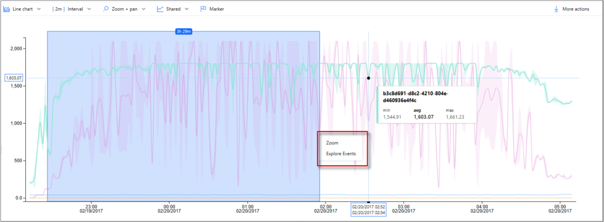](media/v2-update-explorer/preview-chart-zoom.png#lightbox)

After you perform the **Zoom** action, your selected data set will be displayed. Select the format control to cycle through the three y-axis representations of your data.

  

Here, an example of an **overlapping chart** is provided:

  

The **More actions** button expands to display the **Download as CSV**, **Connect to Power BI**, **Show chart data as a table**, and **Explore raw events** options.

  [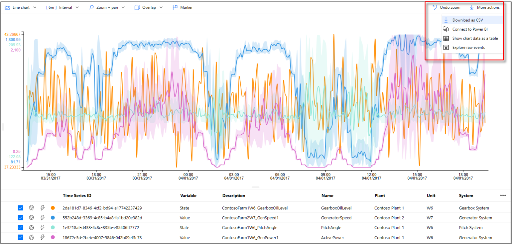](media/v2-update-explorer/more-actions-icon.png#lightbox)

Learn more about the **Connect to Power BI** option in [Power BI connector](concepts-power-bi.md).

## 6. Time editor panel

When working with Azure Time Series Insights Gen2 you first will select a time span. The selected time span will control the data set that is available for manipulation with the Azure Time Series Insights Gen2 update widgets.

  

> [!TIP]
> A portion of the timeline is highlighted in an amber or orange color to indicate the span of data that is available in warm store.

The following web controls are available in Azure Time Series Insights Gen2 for selecting your working time span.

  

1. **Inner date range slider control**: Use the two endpoint controls by dragging them over the time span you want. This inner date range is constrained by the outer date range slider control.

1. **Increase and decrease date range buttons**: Increase or decrease your time span by selecting either button for the interval you want.

1. **Time span collapse control**: This web control lets you hide all the controls except for the inner date range slider tool.

1. **Outer date range slider control**: Use the endpoint controls to select the outer date range, which will be available for your inner date range control.

1. **Time range slider control**: Use it to quickly switch between preset time span selections, such as the last **30 minutes**, the **last 12 hours**, or a **custom range**. Changing this value also changes the available interval ranges discussed in the interval-size slider tool.

   [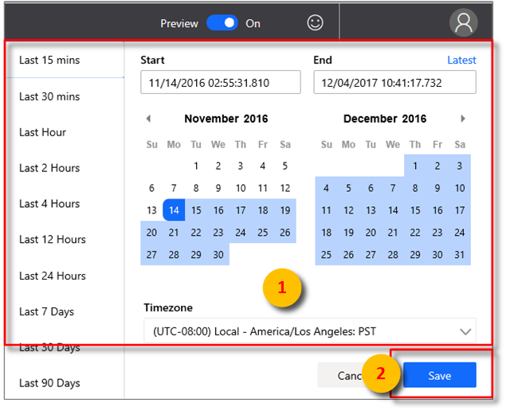](media/v2-update-explorer/to-and-from-element.png#lightbox)

## 7. App bar

The Azure Time Series Insights Gen2 navigation panel appears at the top of your app. It provides the following functionalities:

### Current session share link control

  

Select the new **Share** icon to share a URL link with your team.

  [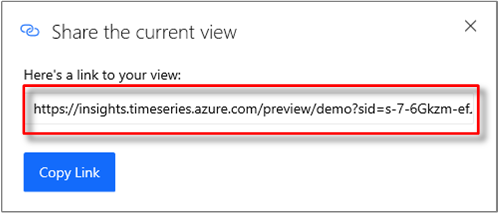](media/v2-update-explorer/tsi-preview-explorer-share-your-view.png#lightbox)

### Tenant section

  

* Displays your current Azure Time Series Insights Gen2 sign-in account information.
* Use it to switch between the available themes.
* Use it to view the Gen2 Demo environment.

### Theme selection

To select a new theme, select your profile icon located in the upper-right corner. Then, select **Change Theme**.

  

> [!TIP]
> Language selection is also available by selecting your profile icon.

Azure Time Series Insights Explorer supports two themes:

* **Light theme**: The default theme shown throughout this document.
* **Dark theme**: Renders the Explorer as shown here:

  [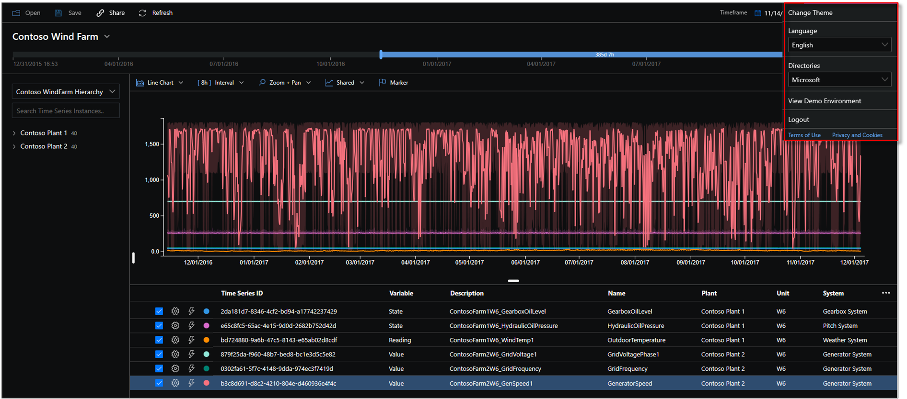](media/v2-update-explorer/tsi-preview-dark-theme-selected.png#lightbox)

## Gen1 environment controls

### Gen2 terms panel

This section applies only to existing Gen1 environments that attempt to use the Explorer in the updated UI. You might want to use the Gen1 product and Gen2 product in combination. We've added some functionality from the existing UI to the updated Explorer, but you can get the full UI experience for a Gen1 environment in the new Azure Time Series Insights Explorer.

Instead of the hierarchy, the Azure Time Series Insights Gen2 terms panel is displayed. The terms panel allows you to define queries in your environment. Use it to also filter data based on a predicate.

  [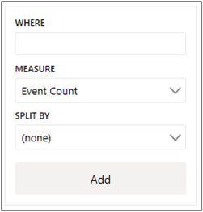](media/v2-update-explorer/s1-s2-preview-query.png#lightbox)

The Azure Time Series Insights Gen2 terms editor panel takes the following parameters:

**Where**: Use the where clause to quickly filter your events by using the set of operands listed in the following table. If you conduct a search by selecting an operand, the predicate is automatically updated based on that search. Supported operand types include the following:

| Operation    | Supported types    | Notes |
| --- | --- | --- |
| `<`, `>`, `<=`, `>=` | Double, DateTime, TimeSpan | |
| `=`, `!=`, `<>` | String, Bool, Double, DateTime, TimeSpan, NULL |
| `IN` | String, Bool, Double, DateTime, TimeSpan, NULL | All operands should be of the same type or be NULL constant. |
| `HAS` | String | Only constant string literals are allowed on the right side. Empty string and NULL aren't allowed. |

To learn more about supported query operations and data types, read [Time Series Expression (TSX)](/rest/api/time-series-insights/reference-time-series-expression-syntax).

### Examples of where clauses

  

**Measure**: A drop-down list that displays all the numeric columns (**Doubles**) you can use as elements for your current chart.

**Split by**: This drop-down list displays all the available categorical columns (Strings) in your model that you can group your data by. You can add up to five terms to view on the same x-axis. Enter the parameters you want, and then select **Add** to add a fresh term.

  [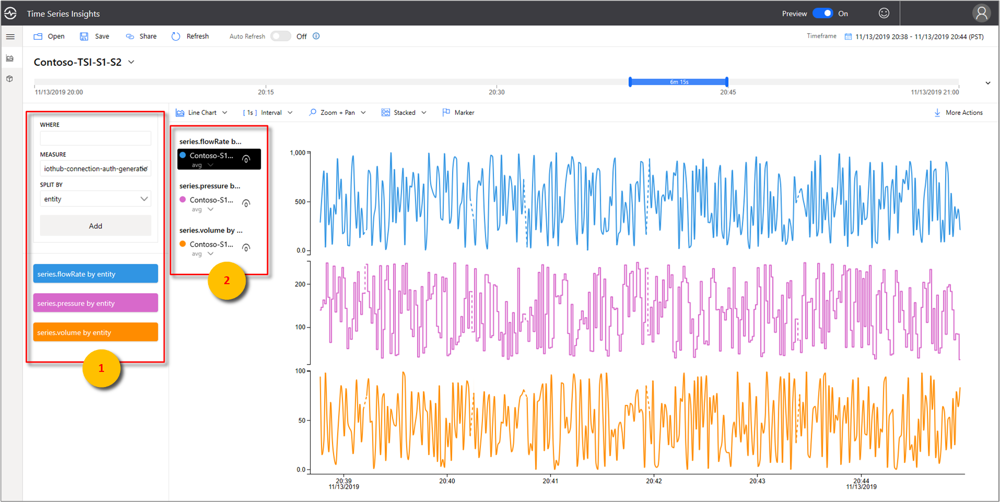](media/v2-update-explorer/s1-s2-preview-filtered-view.png#lightbox)

You can show and hide elements in the chart panel by selecting the visible icon, as shown in the following image. To completely remove queries, select the red **X**.

  [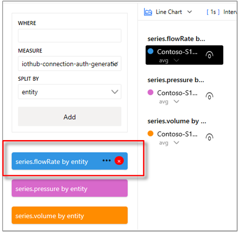](media/v2-update-explorer/s1-s2-preview-filtered-view-cancel.png#lightbox)

## Next steps

* Learn about [ingesting data](./concepts-ingestion-overview.md) into your environment.

* Check out the article on [storage](concepts-storage.md).

* Read about [data modeling](./concepts-model-overview.md) in Azure Time Series Insights Gen2.

* Learn [how to diagnose and troubleshoot](./how-to-diagnose-troubleshoot.md) your environment.
